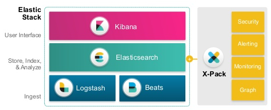
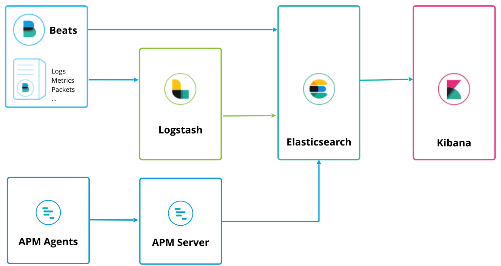
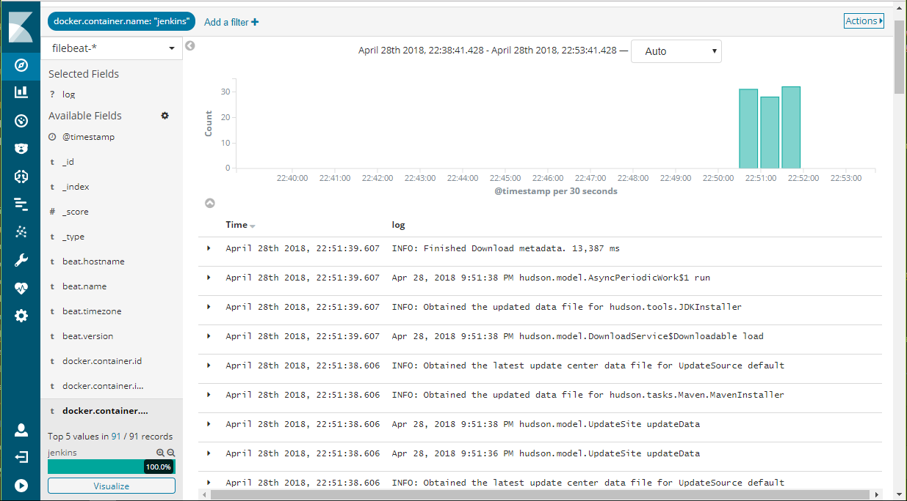
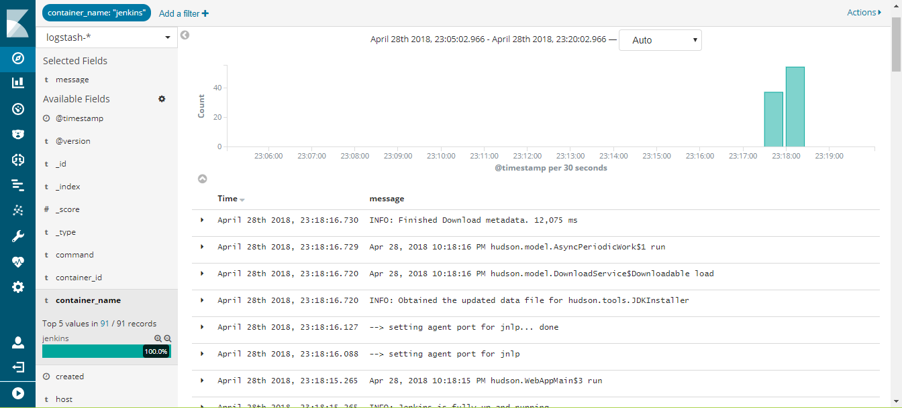

[](https://travis-ci.org/shazChaudhry/docker-elastic)

# User story
As a DevOps team member, I want to install [Elastic Stack](https://www.elastic.co/products) _(v7.9.1 by default)_ so that all application and system logs are collected centrally for searching, visualizing, analyzing and reporting purpose

<p align="center">
  
</p>

# Assumptions
* Infrastructre is setup in [Docker swarm mode](https://docs.docker.com/engine/swarm/)
* All containerized custom applications are designed to start with [GELF](http://docs.graylog.org/en/2.2/pages/gelf.html) log driver in order to send logs to Elastic Stack
* **NOTE:** for cases where filebeat is to be run in "[Docker for AWS](https://docs.docker.com/docker-for-aws/)": you will need to turn off [auditd](./elk/beats/filebeat/config/filebeat.yml) module in the filebeat config. Otherwise, filebeat service will fail to run

# Architecture
The architecture used is shown in the table below
<table>
  <tr>
    <th>High level design</th>
    <th>In scope</th>
    <th>Not in scope</th>
  </tr>
  <tr>
    <td></td>
    <td>
      Only beats for log files and metrics are used. All logs and metrics are shipped to elasticsearch directly in this repo. </br>
      2x Elasticsearch, 1x apm-server and 1x Kibana are used.
    </td>
    <td>Ingest nodes are not used</td>
  </tr>
  <tr>
    <td></td>
    <td>All containerized custom applications are designed to start with GELF log driver in order to send logs to Elastic Stack</td>
    <td>-</td>
  </tr>
</table>

For the full list of free features that are included in the basic license, see: https://www.elastic.co/subscriptions

# Prerequisite
* One docker swarm mode cluster allocated to running Elastic Stack. This cluster must have at least two nodes; 1x master and 1x worker. On each Elasticsearch cluster node, maximum map count check should be set to as follows:  _(required to run Elasticsearch)_
  * `sudo sysctl -w vm.max_map_count=262144`
  * `sudo echo 'vm.max_map_count=262144' >> /etc/sysctl.conf` (to persist reboots)
* One docekr swarm mode cluster allocated to running containerized custom applications. This cluster must have at least on node; 1x master

# Get docker compose files
You will need these files to deploy Eleasticsearch, Logstash, Kibana, and Beats. So, first SSH in to the master node of the Docker Swarm cluster allocated to running Elastic Stack and clone this repo by following these commands:
  * `alias git='docker run -it --rm --name git -u $(id -u ${USER}):$(id -g ${USER}) -v $PWD:/git -w /git alpine/git'` _(This alias is only required if git is *not* already installed on your machine. This alias will allow you to clone the repo using a git container)_
  * `git version`
  * `git clone https://github.com/shazChaudhry/docker-elastic.git`
  * `cd docker-elastic`

# Deploy Elastic Stack
* SSH in to the master node of the Docker Swarm cluster allocated to running Elastic Stack. Deploy Elastic stack by running the following commands:
  * `export ELASTIC_VERSION=7.9.1`
  * `export ELASTICSEARCH_USERNAME=elastic`
  * `export ELASTICSEARCH_PASSWORD=changeme`
  * `export INITIAL_MASTER_NODES=node1` _(See Important [discovery and cluster formation settings](https://www.elastic.co/guide/en/elasticsearch/reference/current/modules-discovery-hosts-providers.html))_
  * `export ELASTICSEARCH_HOST=node1` _(node1 is default value if you are creating VirtualBox with the provided Vagrantfile. Otherwise, change this value to one of your VMs in the swarm cluster)_
  * `docker network create --driver overlay --attachable elastic`
  * `docker stack deploy --compose-file docker-compose.yml elastic` 
    * You will need to be a little patient and wait for about 5 mins to allow stack to be ready
    * Assuming you have only two VMs, this will deploy a reverse proxy, logstash, Kibana and 2x Elasticsearch instances in Master / data nodes configuration. Please note that Elasticsearch is configured to start as a global service which means elasticsearch data nodes will be scalled out automatically as soon as new VMs are added to the Swarm cluster. Here is an [explaination on various Elasticsearch cluster nodes](https://discuss.elastic.co/t/node-types-in-an-elasticsearch-cluster/25488)
* Check status of the stack services by running the following commands:
  * `docker stack services elastic`
  * `docker stack ps --no-trunc elastic` _(address any error reported at this point)_
  * `curl -XGET -u ${ELASTICSEARCH_USERNAME}:${ELASTICSEARCH_PASSWORD} ${ELASTICSEARCH_HOST}':9200/_cat/health?v&pretty'` _(Inspect cluster health status which should be green. It should also show 2x nodes in total assuming you only have two VMs in the cluster)_
* If in case beats are also desired to be installed in this very docker swarm cluster, then use the instructions provided in the next section

# Deploy Beats
SSH in to the master node of the Docker Swarm cluster allocated to running containerized custom applications and beats. Clone this repo and change directory as per the instructions above.

Execute the following commands to deploy filebeat and metricbeat:
  * `export ELASTIC_VERSION=7.9.1`
  * `export ELASTICSEARCH_USERNAME=elastic`
  * `export ELASTICSEARCH_PASSWORD=changeme`
  * `export ELASTICSEARCH_HOST=node1` _(node1 is default value if you are creating VirtualBox with the provided Vagrantfile. Otherwise, change this value to your Elasticsearch host)_
  * `export KIBANA_HOST=node1` _(node1 is default value if you are creating VirtualBox with the provided Vagrantfile. Otherwise, change this value to your Kibana host)_
  * `docker network create --driver overlay --attachable elastic`

## Filebeat
  * `docker stack deploy --compose-file filebeat-docker-compose.yml filebeat`  _(Filebeat starts as a global service on all docker swarm nodes. It is only configured to pick up container logs for all services at '`/var/lib/docker/containers/*/*.log`' (container stdout and stderr logs) and forward thtem to Elasticsearch. These logs will then be available under filebeat index in Kibana. You will need to add additional configurations for other log locations. You may wish to read [Docker Reference Architecture: Docker Logging Design and Best Practices](https://success.docker.com/article/docker-reference-architecture-docker-logging-design-and-best-practices))_
  * Running the following command should print elasticsearch index and one of the rows should have _filebeat-*_
    * `curl -XGET -u ${ELASTICSEARCH_USERNAME}:${ELASTICSEARCH_PASSWORD} ${ELASTICSEARCH_HOST}':9200/_cat/indices?v&pretty'`

## Metricbeat
  * `docker stack deploy --compose-file metricbeat-docker-compose.yml metricbeat`  _(Metricbeat starts as a global service on all docker swarm nodes. It sends system and docker stats from each node to Elasticsearch. These stats will then be available under metricbeat index in Kibana)_
  * Running the following command should print elasticsearch index and one of the rows should have _metricbeat-*_
    * `curl -XGET -u ${ELASTICSEARCH_USERNAME}:${ELASTICSEARCH_PASSWORD} ${ELASTICSEARCH_HOST}':9200/_cat/indices?v&pretty'`
  <!-- * `docker stack deploy --compose-file packetbeat-docker-compose.yml packetbeat` _(Packetbeat starts as a global service on all docker swarm nodes)_ -->

# Testing
Wait until all stacks above are started and are up and running and then run jenkins container where filebeat is running:
* `docker container run -d --rm --name jenkins -p 8080:8080 jenkinsci/blueocean`
* Login at `http://[KIBANA_HOST]` which should show Management tab
  * username = `elastic`
  * password = `changeme`
* On the Kibana Management tab, configure an index pattern _(if not already done automatically)_
  * Index name or pattern = `filebeat-*`
  * Time-field name = `@timestamp`
* Click on Kibana Discover tab to view containers' console logs _(including Jenkins)_ under filebeat-* index. Here is a screenshot showing Jenkins container logs:
<p align="center">
  
</p>

# Sending messages to Logstash over gelf
Logstash pipeline is configured to accept messages with gelf log driver. Gelf is one of the plugin mentioned in [Docker Reference Architecture: Docker Logging Design and Best Practices](https://success.docker.com/article/docker-reference-architecture-docker-logging-design-and-best-practices). Start an application which sends messages with gelf. An example could be as follows:
* Stop the Jenkins container started earlier:
  * `docker container stop jenkins`
* Start Jenkins container again but with gelf log driver this time:
  * `export LOGSTASH_HOST=node1`
  * `docker container run -d --rm --name jenkins -p 8080:8080 --log-driver=gelf --log-opt gelf-address=udp://${LOGSTASH_HOST}:12201 jenkinsci/blueocean`
  * Note that _`--log-driver=gelf --log-opt gelf-address=udp://${LOGSTASH_HOST}:12201`_ sends container console logs to Elastic stack
* On the Kibana Management tab, configure an index pattern
  * Index name or pattern = `logstash-*`
  * Time-field name = `@timestamp`
* Click on Discover tab and select logstash-* index in order to see logs sent to Elasticsearch via Logstash. Here is a screenshot showing Jenkins container logs:
<p align="center">
  
</p>

Here is another example:
* `docker container run --rm -it --log-driver=gelf --log-opt gelf-address=udp://${LOGSTASH_HOST}:12201 alpine ping 8.8.8.8`
* Login to Kibana and you should see traffic coming into Elasticsearch under `logstash-*` index
* You can use syslog as well as TLS if you wish to add in your own certs

# Testing with APM Java Agent
Follow these instructions to build a java app that we will use for APM:
```
WIP
```

# References
- [elastic/examples](https://github.com/elastic/examples) - Home for Elasticsearch examples available to everyone. It's a great way to get started
- [Elasticsearch sizing and capacity planning](https://www.elastic.co/webinars/elasticsearch-sizing-and-capacity-planning) 
- [Unifying APM, Logs, and Metrics for Deeper Operational Visibility](https://www.elastic.co/webinars/agumenting-logs-and-metrics-with-apm?blade=tw&hulk=social)
- [ Machine Learning in the Elastic Stack - YouTube](https://www.youtube.com/watch?v=n6xW6YWYgs0&feature=youtu.be)
- [Security and Threat Detection with the Elastic Stack](https://www.elastic.co/webinars/security-and-threat-detection-with-the-elastic-stack)
