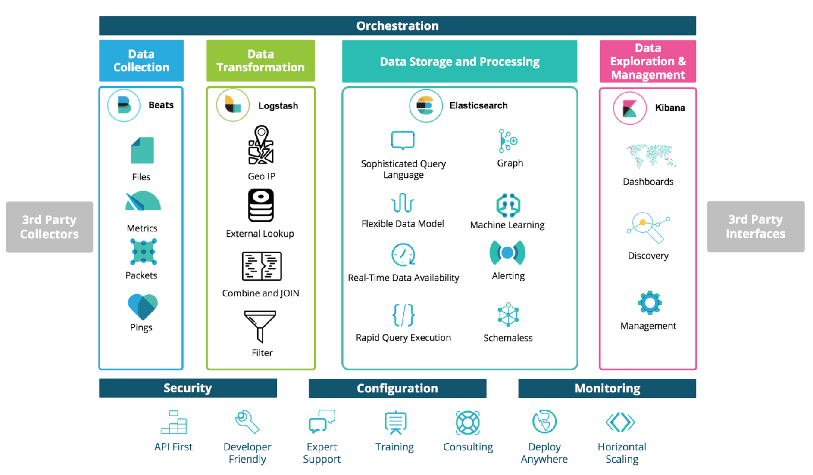
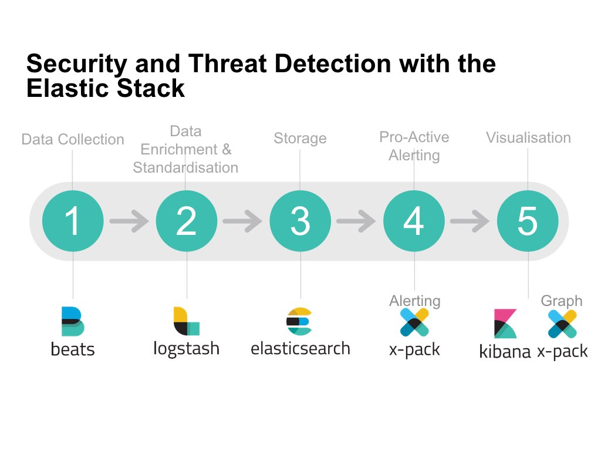

[](https://travis-ci.org/shazChaudhry/docker-elastic)

### User story
As a DevOps team member, I want to install [Elastic Stack](https://www.elastic.co/products) so that all application and system logs are collected centrally for searching, visualizing, analyzing and reporting purpose

<p align="center">
  <br>
  <a href="https://www.elastic.co/blog/psd2-architectures-with-the-elastic-stack-part-ii">Monitoring Modern Banking API Architectures with the Elastic Stack, Part II</a>
</p>

<p align="center">
  
  
  <br>
  <a href="https://www.elastic.co/guide/en/logstash/current/deploying-and-scaling.html">Deploying and Scaling Logstashedit</a>
</p>

<p align="center">
  <br>
  <a href="https://www.elastic.co/webinars/security-and-threat-detection-with-the-elastic-stack">Security and Threat Detection with the Elastic Stack</a>
</p>

<p align="center">
  <br>
  <a href="https://www.elastic.co/webinars/security-and-threat-detection-with-the-elastic-stack">Machine Learning and Elasticsearch for Security Analytics</a>
</p>


### Assumptions
All containerized custom application services will start with [GELF](http://docs.graylog.org/en/2.2/pages/gelf.html) log driver in order to send logs to Elastic Stack. Please see **TODO** section below

### Prerequisite
* Infrastructre is setup in [Docker swarm mode](https://docs.docker.com/engine/swarm/)
* On each cluster node, ensure maximum map count check _(required for Elasticsearch)_ is set: `sudo sysctl -w vm.max_map_count=262144`

### Installation instructions
* Login to the master node in your Docker Swarm cluster
* Clone this repo and change directory by following these commands
```
  alias git='docker run -it --rm --name git -v $PWD:/git -w /git indiehosters/git git'
  git version
  git clone https://github.com/shazChaudhry/docker-elastic.git
  sudo chown -R $USER:$USER docker-elastic
  cd docker-elastic
  ```
* Deploy Elastic stack by running the following commands:
  * `export ELASTIC_VERSION=6.2.2`
  * `docker network create --driver overlay elastic`
  * `docker stack deploy --compose-file docker-compose.yml elastic` _(This will deploy a reverse proxy, Kibana and 2x Elasticsearch instances in Master and Node configurations. Please note that Elasticsearch is started as a global service which means it will be scalled out automatically as soon as new nodes are added to the docker swarm cluster)_
* Check status of the stack services by running the following commands:
  * `docker stack services elastic`
  * `docker stack ps --no-trunc elastic` _(address any error reported at this point)_
  * `curl -XGET -u elastic:changeme 'localhost:9200/_cat/health?v&pretty'` _(Inspect cluster helth status which sould be green. It should also show 2x nodes in todal)_
* Once all services are running, execute the following commands:
  * `docker stack deploy --compose-file filebeat-docker-compose.yml filebeat`  _(Filebeat starts as a global service on all docker swarm nodes. It is only configured to picks up container logs for all services at '`/var/lib/docker/containers/*/*.log`' and forward thtem to Elasticsearch. These logs will then be available under filebeat index in Kibana. You will need to add additional configurations for other log locations)_
  * Running the following command should print elasticsearch index and one of the rows should have _filebeat-*_
    * `curl -XGET -u elastic:changeme 'localhost:9200/_cat/indices?v&pretty'`
  * `docker stack deploy --compose-file metricbeat-docker-compose.yml metricbeat`  _(Metricbeat starts as a global service on all docker swarm nodes. It sends system and docker stats from each node to Elasticsearch. These stats will then be available under metricbeat index in Kibana)_
  * Running the following command should print elasticsearch index and one of the rows should have _metricbeat-*_
    * `curl -XGET -u elastic:changeme 'localhost:9200/_cat/indices?v&pretty'`

### Testing
* Wait until all stack services are up and running
* Run jenkins container on one of the Docker Swarm node as follows:
  * `docker run -d --rm --name jenkins -p 8080:8080 jenkinsci/blueocean`
* Login at `http://<any_swarm_node_ip>:5601` _(Kibana)_ which should show Management tab
  * username = `elastic`
  * password = `changeme`
* On the Kibana Management tab, configure an index pattern
  * Index name or pattern = `filebeat-*`
  * Time-field name = `@timestamp`
* Click on Kibana Discover tab to view jenkins console logs

### TODO
* Start Logstash _(logstash-docker-compose.yml)_ in docker swarm mode. Logstash pipeline is configured to accept messages with gelf plugin
* Start an application which sends messages with gelf log driver. An example could be as follows:
  * `docker container run -d --rm --name jenkins -p 8080:8080 -p 50000:50000 -v jenkins_home:/var/jenkins_home --log-driver=gelf --log-opt gelf-address=udp://127.0.0.1:12201  jenkinsci/blueocean`
  * Note that _`--log-driver=gelf --log-opt gelf-address=udp://127.0.0.1:12201`_ sends container console logs to Elastic stack

### References
- [Installing Elastic Stack](https://www.elastic.co/guide/en/elastic-stack/current/installing-elastic-stack.html)
- [Elastic Examples](https://github.com/elastic/examples)
- [ Machine Learning in the Elastic Stack - YouTube](https://www.youtube.com/watch?v=n6xW6YWYgs0&feature=youtu.be)
